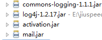

# 自己对于Log4j的新认识
[TOC]
## 前情提要
以前一直都是在本地跑的东西，从来没想过用log4j，有什么问题就debug一下，可最近遇到坑爹的微信算是彻底载再微信手上了，授权功能不在手机微信客户端跑还不让继续运行下去，微信支付也不提供测试接口，一直都只能用公司的公众号来做测试，要实现的东西基本得用公网才行，这里就说到重点，公网，我自己并没有公网ip，sae的java又贵得离谱，只能用公司的公网，但是，公司这边并不会把对公网的操作交给我，这就造成我没有办法用熟悉的debug，也没法用system.out.prntln来输出错误，更糟糕的是，自己的历史问题导致无法简单的在页面输出错误信息，我只能一次一次的将代码提交，再拜托公网管理员布置代码再重启服务器，一来一回都不知道耗费多少时间，最重要的是，我自己不嫌烦，公网管理员也不会是那么有耐心的。
最终我实在是受不了这种雾里改代码的感觉了，用上log4j后,绝对是清爽多了，至少我是能够明确的知道我错在哪里，哪里需要修改。
虽然我通过使用log4j成功改掉了bug，但拿到log文件还是得通过公网管理员来拿，这简直又是跳到另一个坑里，有没有跟智能的方法呢。
终于在网上找到，原来log信息可以通过邮件发送来读取的，这简直是太棒了。下面写下简单的实现过程。
## 准备
首先需要几个核心的包

当然你也可以通过maven来下载其中的mail.jar和activation.jar

```
<dependency>
      <groupId>javax.mail</groupId>
      <artifactId>mail</artifactId>
      <version>1.4.7</version>
    </dependency>
```
将这些jar都导入自己的项目中
## 配置文件
在src中创建一个log4j.properties
配置内容如下
```
log4j.rootLogger=error,info,stdout,MAIL
## MAIL
log4j.appender.MAIL=org.apache.log4j.net.SMTPAppender
log4j.appender.MAIL.Threshold=ERROR
log4j.appender.MAIL.BufferSize=1
log4j.appender.MAIL.SMTPHost=smtp.qq.com
#邮件标题
log4j.appender.MAIL.Subject=ErrorMessage
#发件邮箱
log4j.appender.MAIL.From=abc@qq.com
#收件邮箱
log4j.appender.MAIL.To=abc@qq.com
#发件箱登陆用户名
log4j.appender.MAIL.SMTPUsername=abc@qq.com
#发件箱登陆密码
log4j.appender.MAIL.SMTPPassword=abc
log4j.appender.MAIL.layout=org.apache.log4j.PatternLayout
log4j.appender.MAIL.layout.ConversionPattern=[ErrorMessage] %d - %c -%-4r [%t] %-5p %c %x - %m%n
```
这里我用到了qq的smtp来实现发送邮件的功能，而qq邮箱的smtp如何开通呢
登陆QQ邮箱，点击设置

选择账户

点击开启IMAP/SMTP服务，之后会要求你发送短信，之后你会在浏览器那收到qq提供给你的密码，将这个密码写到log4j.appender.MAIL.SMTPPassword中

## runtime
创建一个class
代码大致如下
```

import java.util.List;

import org.apache.log4j.Logger;
import org.apache.log4j.PropertyConfigurator;

public class testlog {
	static Logger LOGGER = Logger.getLogger(testlog.class.getName());

	public static void main(String[] args) {
		PropertyConfigurator.configure("./src/log4j.properties");
		try {
			List a = null;
			System.out.println(a.size());
		} catch (Exception e) {
			LOGGER.error("run error", new Throwable("test"));
		}
	}
}
```
运行之后就会收到邮件了。